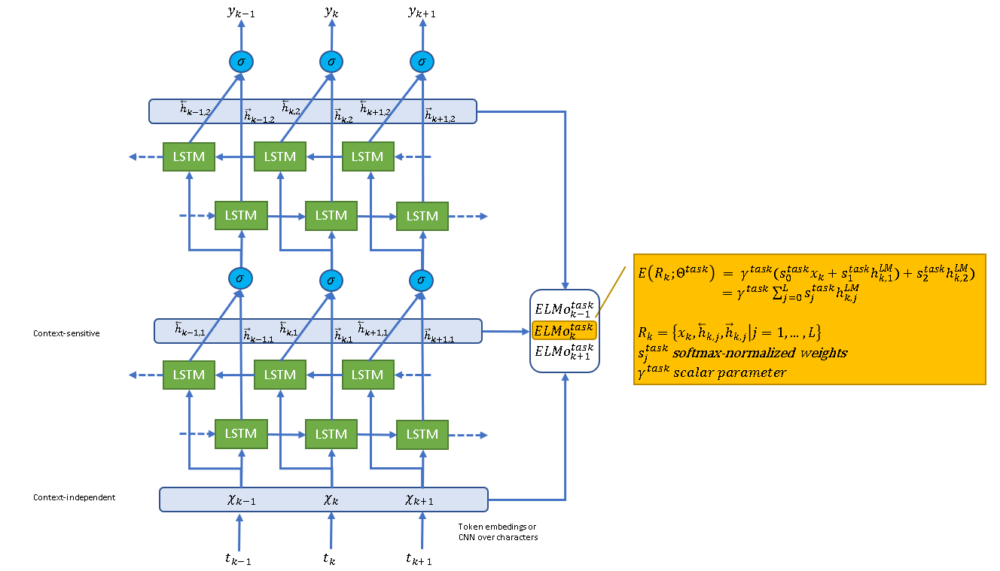

# sdtm-mapper
Sam Tomioka

Feb 2019

- [About:](#about)
- [Installation](#installation)
- [Tutorials](#tutorials)
- [Notes](#notes)
- [Comments, Issues:](#issues)
- [Disclaimer](#disclaimer)
- [References:](#reference)

## [About:](#about)

[**sdtm-mapper**](https://pypi.org/project/sdtm-mapper/) is a package to assist creation of machne readable CDISC SDTM mapping specifications with Python. This can be used for following tasks.

1. Generates a empty specifications for training data from a user provided SAS dataset. This empty specification will contain SAS dataset attributes.  You don't need to use `Proc Contents` in SAS to do this! SAS datasets maybe in your aws s3 bucket or local folder.
2. Run models to generate a mapping specifications.
3. Generates your own mapping models using your data. The models can be trained to generate the target variables but also programming sudo code.

The first version comes with **three pre-trained models** (Included in the package). These are trained on feed forward NN with trainable ELMo embedding layer for 34 classes using **adverse event** datasets from 18 clinical trials, and validation was done on 3 clinical trials until the models were optimized. Test was done on 1 clinical trial. 22 clinical trials data are extracted from **Medidata Rave** built by 3 different CROs and Sunovion Pharmaceuticals.

| Models                 | Parameters | Training Acc | Validation Acc | Test Acc* |
|------------------------|------------|--------------|----------------|----------|
|1. Elmo+sfnn+ae+Model1.h5 | 271,142    |  0.9795        | 0.9800        | 0.9540   |
|2. Elmo+fnn+ae+Model2.h5  | 664,870    | 0.9846      | **1.0000**         | 0.9425   |
|3. Elmo+fnn+ae+Model3.h5  | 594,854    | **0.9966**       | **1.0000**         | **0.9666**   |
**Table 1 - Performance of three models** <br>
\* Macro accuracy account for system variables for 'drop'.

High variance models may be due to addition of CDASH metadata, and probably better to remove them.

Improvement of the task specific model are explored by Peters et.al [1]:

1. Freeze context-independent representations from the pre-trained biLM and concatenate them and $ELMo^{task}_{k}$ and pass that into task RNN.
2. Replacing $h_k$ with $[x_k; ELMo^{task}_{k}]$. Peters et.al [1] has shown improved performance in some tasks such as SNLI and SQuAD by including ELMo at the output of the task RNN.
3. Add a moderate amount of dropout to ELMo.
4. Regularize the ELMo weights by adding $\gamma||w||^2_2$ to the loss function.

These can be considered as future enhancment for other domains that may not perform well.


Here is the architecture of ELMo.


**Figure 1** - biLM architecture for ELMo

## [Installation](#installation)
```unix
pip install sdtm-mapper
```

## [Tutorials](#tutorials)

1. [Tutorial on how to use sdtm-mapper to generate mapping specifications](https://colab.research.google.com/drive/1A8rzsYq7jKhTgTki7DSzDlvdrew414j4?ts=5c78a25c) Try this on Colab!
2. [Train your data using SDTMMapper on Model 1](https://github.com/stomioka/sdtm_mapper/blob/master/tutorials/Build_model_1.ipynb): Note that you need to supply your training data.


## [Notes](#notes)
You have to have an environment to use **tensorflow**, **tensorflow-hub** etc.

If you want to contribute for adding more models for different SDTM domains, please join [PhUSE ML Project Community](https://www.phusewiki.org/wiki/index.php?title=Machine_Learning_/_Artificial_Intelligence). Most of the work has been done during the weekends or evening. Your contributions are always welcome!

**Notes about the trained models**:

The models were build and trained on raw AE datasets from clincial trials conducted by Sunovion Pharmaceuticals. The EDC system we use is Medidata RaveX. The training data contains some e-source data. The performance may not be good for your data.  You can also build your models using SDTMMapper tool and use your custom model for your datasets.

Old reame file is found [here](https://github.com/stomioka/sdtm_mapper/blob/master/old_readme.md)


## [Comments, Issues:](#issues)

For any questions, comments, suggestions, or issues, please post them [here](https://github.com/stomioka/sdtm_mapper/issues)

For personal communication related to SDTMMapper, please contact [Sam Tomioka](sam.tomioka@sunovion.com)

## [Disclaimer](#disclaimer)
This is not an official Sunovion Pharmaceuticals product.


## [References:](#reference)
1] Peters,M et al. (2018). Deep contextualized word representations
